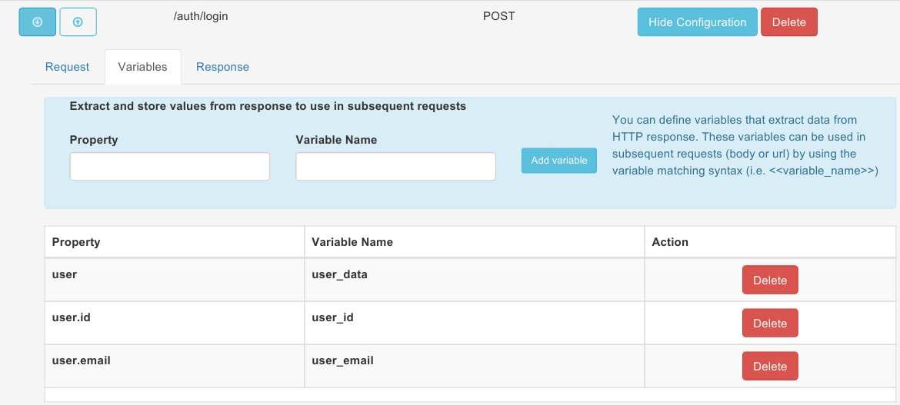

# Variables

Variables are the way used to chain multiple requests in the same test suite.
By using variables, the result - or a part of a result - from a request can be used as input for another request.
The variables scope are limited inside the current test suite execution and are available to be used in the following request url, body or response validation schema.

## Variables types

There are two categories of variables:
* response variables - variables that are created based on HTTP responses
* system variables - variables created automatically by the system, for each test suite execution and that can be used to create random content requests.

### Response variables

These variables are created based on HTTP response or part of them. Data is extracted from response body by specifying the path of the target data.
Property will define the key of the response JSON object which value will be stored as the defined variable.

Example:

Response body:

```
{
  "user": {
    "nick": "u1",
    "email": "u1@example.com",
    "name": "nu1",
    "when": "2015-10-23T12:09:20.198Z",
    "id": "3fy5gc"
  },
  "login": {
    "nick": "u1",
    "email": "u1",
    "user": "3fy5gc",
    "why": "password",
    ............
  },
  "ok": true
}
```

#### Example

| Property | Value |
|----------|-------|
| user | ``` { "nick": "u1", "email": "u1@example.com", "name": "nu1", .....} ``` |
| user.id | ``` "3fy5gc" ``` |




### System variables

These are a set of predefined variables types that can be defined in the same way as the response variables, only for property the allowed values are:

* ```<<random_string>>``` - for random generated string
* ```<<random_number>>``` - for random generated number

For these variables the system will generate a random value that will be stored in the corresponding variable for future usage.


# Using variables

Defined variables can be used in subsequent requests for changing the url, request body or response validation schema.

The syntax used for a variable is ```<<variable_name>>```. Here are some examples for using the variables.

The variables can be used:
* In the request body
* In the request URL
* In the response validation schema
